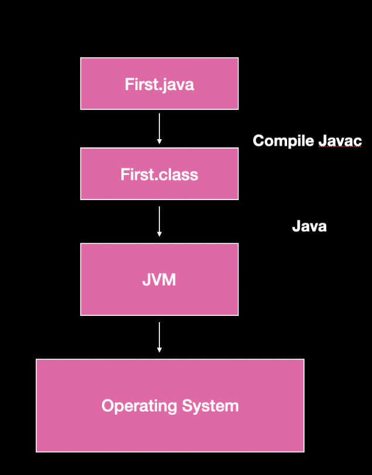
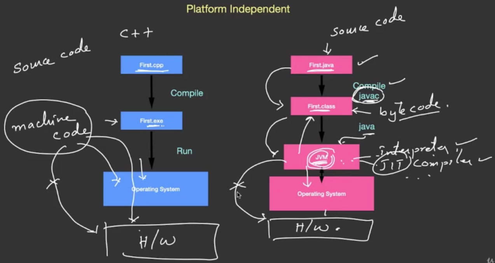
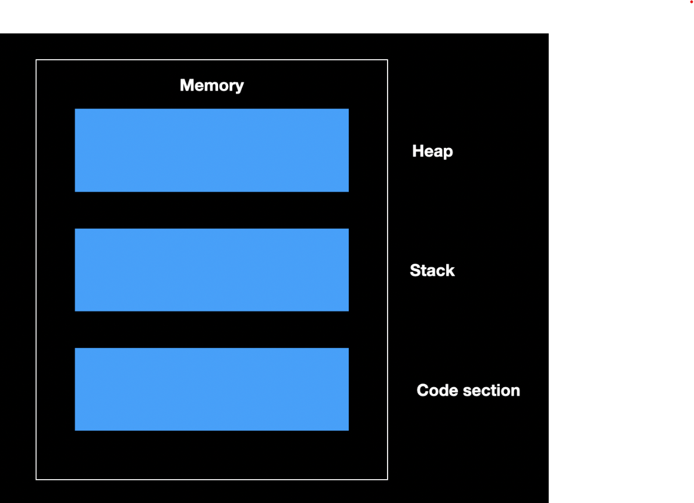
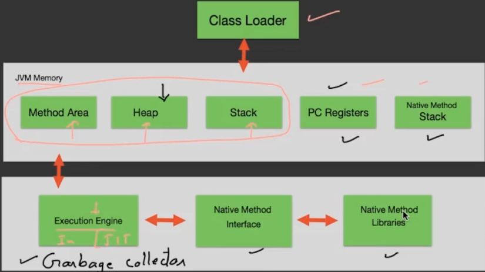
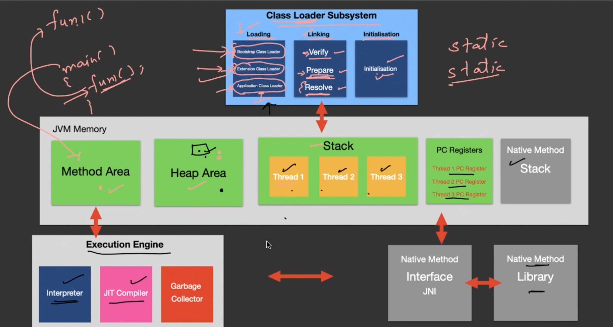
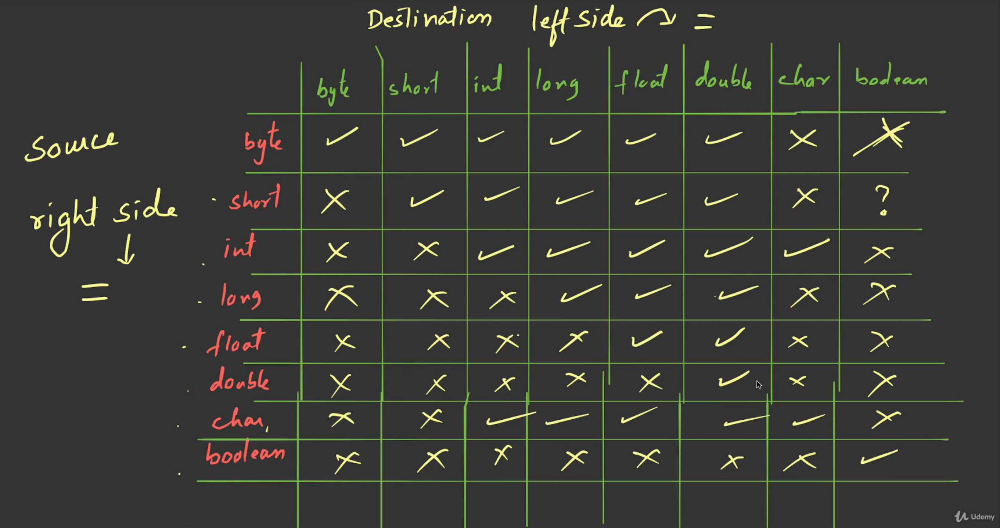

- [About The Project](#about-the-project)
- [01-introduction](#01-introduction)
- [02-data-types](#02-data-types)
- [03-features-and-architecture](#03-features-and-architecture)
- [04-operator-and-expressions](#04-operator-and-expressions)
- [05-string-class-and-printing](#05-string-class-and-printing)

&nbsp;

# About The Project

- Learn JAVA Programming - Beginner to Master
- Deep Dive in Core Java programming -Standard Edition. A Practical approach to learn Java. Become a Java Expert
- [YouTube - Abdul Bari](https://www.youtube.com/channel/UCZCFT11CWBi3MHNlGf019nw)
- [GitHub - Abdul Bari](https://github.com/mohammedabdulbari)
- [Original Repo](https://github.com/mohammedabdulbari/Java-SE)

&nbsp;

# 01-introduction

- **JDK:** Java Development Toolkit
  - First.java -> `javac First.java` (Compiler) -> First.class
- **JRE:** Java Runtime Environment (Class Library)
  - `java First` (Executing First.class)
- **JVM:** Java Virtual Machine
- [stackchief - Which Version of Java Should You Use?](https://www.stackchief.com/blog/Which%20Version%20of%20Java%20Should%20You%20Use%3F)
- [Oracle - Class Scanner](https://docs.oracle.com/en/java/javase/11/docs/api/java.base/java/util/Scanner.html)
- `javap java.util.Scanner`

&nbsp;

# 02-data-types

```sh
javap java.lang.Integer
javap java.lang.Byte
javap java.lang.Float
javap java.lang.Character
javap java.lang.Boolean
```

- [javapoint - Java Naming Convention](https://www.javatpoint.com/java-naming-conventions)
- [Oracle - 3.8. Identifiers](https://docs.oracle.com/javase/specs/jls/se7/html/jls-3.html#jls-3.8)
- **Variables Naming Rules**
  1. Case Sensitive
  2. Contains Alphabets, Numbers, \_ or $
  3. Starts with Alphabet, \_ or $
  4. Should not be a keyword
  5. Should not be a class name, if class is also in use
  6. No limit on length of name
  7. Follow camelCases
- Variable is the name given to the memory. When a variable is declared, memory is allocated.
- Literals are the values, used in the program to store them in variables.
- **Literals**
  - Literals Type

|             |      |          Number System          |                  |
| :---------: | :--: | :-----------------------------: | :--------------: |
|   Decimal   | (10) |       0,1,2,3,4,5,6,7,8,9       |   `byte b=10;`   |
|   Binary    | (2)  |               0,1               | `byte b=0b1010;` |
|    Octal    | (8)  |    0,1,2,3,4,5,6,7,10,11,12     |  `byte b=012;`   |
| Hexadecimal | (16) | 0,1,2,3,4,5,6,7,8,9,A,B,C,D,E,F |  `byte b=0xA;`   |

&nbsp;

|  Type   |       Size        |                       Range                       |       Default       |
| :-----: | :---------------: | :-----------------------------------------------: | :-----------------: |
|  Byte   |         1         |                    -128 to 127                    |          0          |
|  Short  |         2         |                  -32768 to 32767                  |          0          |
|   int   |         4         |             -2147483648 to 2147483647             |          0          |
|  long   |         8         |  -9223372036854775808 to</br>9223372036854775807  |          0          |
|  float  |         4         |               ±1.4E-45 to ±3.4E+38                |        0.0f         |
| double  |         8         |                ±439E to ±1.7E+308                 |        0.0d         |
|  Char   |         2         | '\u0000' to '\uffff'</br>that is, from 0 to 65535 | '\u0000'</br>\40000 |
| Boolean | Depends on<br>JVM |                    True/ False                    |        FALSE        |

- [Unicode](www.unicode.org)
- **Integral DataType**
  - The reason for java having short type of data is for smaller number for efficient memory utilization , therefore byte is also used for the same purpose
  - They are all signed datatype as all of them support both positive and negative datatype
  - In bytes one bit is reserved for sign value ( + , - )
  - Number can be stored only in 7 bits
  - The minimum number that can be stored in this 7 bits is 0 and max is 127
  - The negative numbers are stored in two’s compliment form

&nbsp;

# 03-features-and-architecture

- **Aim**
  - To check errors
  - Convert into machine code
  - Execution/ running a program: Compiler does not takes responsibility of execution , Interpreter is responsible for execution of code
- **Compiler**
  - Language e.g.: C & C++
  - Compiler will convert program into machine code if they are no error
  - Compilation from source code to machine code is done only once
  - As translation is done once that’s why compiler doesn't run codes
  - Even if there’s one error in the program , it will not compile the full code must be error free to transform into machine code.
- **Interpreter**
  - JavaScript is an interpreter based language
  - JS runs inside browser , it cannot run independently
  - It translate and runs/ executes the code line by line
  - Translation is done again and again
- **Compiler vs interpreter**
  - Compiler is faster than interpreter
  - In interpreter if there is error in one line the code will still execute
  - Interpreter language is easy than compiler language



- **Platform Independent**
  - Java is platform independent language
  - Java compiler will convert source code into byte code although this byte code is not executable but it is a error free program
  - To execute this java program we call a JVM (java virtual machine) and ask them to execute this file
  - This virtual machine will have an interpreter or JIT Compiler that will convert this byte code into machine code and get it executed on the hardware
  - JVM cannot directly interact with the hardware , it needs to interact via a software
- **How java is platform independent**
  - All the bytes codes first interact with JVM , as it is the source which converts the source code into the machine code of java
  - As the byte code is same it can run on various operation system and produce the same result provided that it has a JVM hence Java is platform independent
  - Therefore once you compile a java code you can run it anywhere



- **Architecture of JVM**
  - JVM is responsible for executing the java code
  - The main memory is in 3 parts:
    - one where the **main** program resides
    - the other for storing the program data like variables etc this values are stored in **stack** area
    - the last space is free space which is used during the run time of program and is called **heap** area



- The file with the program is loaded into the code section and the process is called **class loading** as all java code is in class format
- The job of bringing the code into memory is done by class loader
- The interpreter inside Java code is used to convert the code into the machine code and get executed
- Dynamic values are created inside heap when you say `new`
- Local variables are created inside stack and they belong to main memory
- When print is called its own stack is created
- JVM also has **garbage collector it takes away the values in heap** which are not in use
- JVM keeps the addresses of next instructions that needs to be executed and it will hand it over to the CPU
- In java we can invoke or call the methods of other languages like c, c++ this is called **native methods**, there will be a separate stack for this





- **Features**
  - **Simple**
  - It is **secure**, as it cannot get infected by virus or any malware because of JVM as it has a securer/ verifier
  - It is Platform independent hence **portable**
  - The style of java **programming object oriented** I.e, Abstraction, Inheritance, Encapsulation and Polymorphism
  - Even if there is unavailability of program JVM makes sure to run it without any crashes in it therefore it is very **robust** this is achieved by **exception handling**
  - Java supports **multithreading**
  - Java is hardware **architectural neutral** so, it can run on any hardware
    - Von-Neumann Architecture
  - It is interpreter language but gives **high performance**
  - It supports **distributed** computing which is mostly used by businesses globally where multiple business are connected to a single network
  - Java is **dynamic** because it is created in heap

&nbsp;

# 04-operator-and-expressions

- The mechanism of converting data type internally by the compiler is known as **COERCION**.
- **Bit Merging and Masking:**
  - One of the application of bitwise operators.
  - They are used to check whether the bits are marked as zero or one.
  - The process of setting one of the bit as ‘1’ is known as merging.
  - Masking means you are hiding all the bits and showing only particular bits
  - 4 bits is also known as nibble.
  - XOR operation is used for Swapping two numbers without inserting any third number.
- **Widening and Narrowing:**
  - It is related to conversion of data type of given data item.
  - **Widening**: the process of storing the data of **smaller size data type into a larger size data type** can be done automatically by the compiler.
    - The compiler directly converts the data type without showing any errors i.e from source data type to the destination data type.
    - Since it is done internally it is said as automatically.
    - The source and destination data type should be **compatible**.
    - It is also known as **upcasting**.
  - **Narrowing:** the process of storing the data of **larger size data type into a smaller size data type**.
    - due to difference in size it may lead to loss of data.
    - it is not compatible.
    - typecasting is required for narrowing.
    - is also called **down casting**.
  - Boolean is compatible only with Boolean.

|                      |      |
| :------------------: | :--: |
|         AND          |  &   |
|          OR          | \|\| |
|         NOT          |  ~   |
|         XOR          |  ^   |
|     Right Shift      |  >>  |
| Unsigned Right Shift | >>>  |
|      Left Shift      | <<<  |

- **Bitwise Operator** are faster than other operators
  - It works on the principle of Truth Tables

|  A  |  B  | A & B |
| :-: | :-: | :---: |
|  0  |  0  |   0   |
|  0  |  1  |   0   |
|  1  |  0  |   0   |
|  1  |  1  |   1   |

|  A  |  B  | A \| B |
| :-: | :-: | :----: |
|  0  |  0  |   0    |
|  0  |  1  |   1    |
|  1  |  0  |   1    |
|  1  |  1  |   1    |

|  A  |  B  | A ^ B |
| :-: | :-: | :---: |
|  0  |  0  |   0   |
|  0  |  1  |   1   |
|  1  |  0  |   1   |
|  1  |  1  |   0   |

- These bitwise operator are performed only on integer type of data
- If you are taking byte and short the result will still be an integer
- The data type which are compatible with each other is given below , source is in right hand side , destination is on left hand side



&nbsp;

# 05-string-class-and-printing

- Overloaded method
- `String str1` = "Java Program"
  - `str1`: reference name
  - `"Java Program"`: string object
- String is a built-in class available in java.
- Variable of type object are called as reference.
- String object is referred to as a literal.
- References are used for holding or pointing objects.
- String literal is taken in “ “.
- Keyword `new` is taken to create an object in **heap**.
- Constructors are methods or functions used for creating string object.
- There are three types of constructors:
  - `String(char[])`: Array of characters is taken and is converted into string.
  - `String(byte[])`: Array of bytes is taken and is converted into a string.
  - `String(string)`:
    - A string literal is taken in this method.
    - New string is created using this method.
- Java maintains a pool of string constants.
- **Whenever new is applied the object is created in heap memory and the memory occupied by the object literal is in pool.**
- **When same literal is used java does not create another object.**
- **When new is applied the object in pool may or may not be created.**
- String objects are immutable/ they cannot be modified.

&nbsp;
