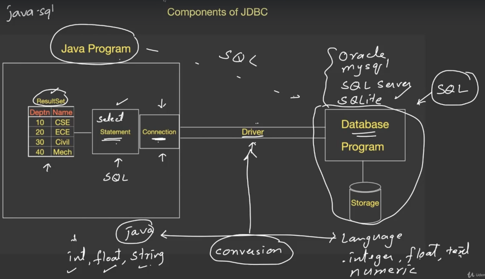

- [About The Project](#about-the-project)
- [\_01introduction](#_01introduction)
- [\_02dataTypes](#_02datatypes)
- [\_03featuresAndArchitecture](#_03featuresandarchitecture)
- [\_04operatorAndExpressions](#_04operatorandexpressions)
- [\_05stringClassAndPrinting](#_05stringclassandprinting)
- [\_06conditionalStatements](#_06conditionalstatements)
- [\_07loops](#_07loops)
- [\_08arrays](#_08arrays)
- [\_09methods](#_09methods)
- [\_10oop](#_10oop)
- [\_11inheritance](#_11inheritance)
- [\_12abstractClasses](#_12abstractclasses)
- [\_13interfaces](#_13interfaces)
- [\_14innerClasses](#_14innerclasses)
- [\_15staticAndFinal](#_15staticandfinal)
- [\_16packages](#_16packages)
- [\_18exceptionHandling](#_18exceptionhandling)
- [\_19multithreading](#_19multithreading)
  - [Threads](#threads)
  - [Synchronization](#synchronization)
    - [Resource Sharing](#resource-sharing)
    - [Critical Section](#critical-section)
    - [Mutual Exclusion](#mutual-exclusion)
    - [Locking/Mutex](#lockingmutex)
    - [Semaphore](#semaphore)
    - [Monitor](#monitor)
    - [Race Condition](#race-condition)
    - [Inter-Thread Communication](#inter-thread-communication)
- [\_20javaLangPkg](#_20javalangpkg)
  - [Object Class](#object-class)
  - [Wrapper Class](#wrapper-class)
  - [String vs StringBuffer vs StringBuilder](#string-vs-stringbuffer-vs-stringbuilder)
  - [Enum](#enum)
  - [Reflect Package](#reflect-package)
- [\_21annotationsAndJavaDoc](#_21annotationsandjavadoc)
  - [Annotations](#annotations)
- [\_22lambdaExpressions](#_22lambdaexpressions)
- [\_23javaIOStreams](#_23javaiostreams)
- [\_24generics](#_24generics)
- [\_25collectionFramework](#_25collectionframework)
- [\_27dateAndTimeAPI](#_27dateandtimeapi)
- [\_27networking](#_27networking)
  - [OSI Model](#osi-model)
  - [TCP/IP Model](#tcpip-model)
    - [Layer 1: Network Interface (or Link) Layer](#layer-1-network-interface-or-link-layer)
    - [Layer 2: Internet Layer](#layer-2-internet-layer)
    - [Layer 3: Transport Layer](#layer-3-transport-layer)
    - [Layer 4: Application Layer](#layer-4-application-layer)
      - [Key Differences between OSI and TCP/IP Models](#key-differences-between-osi-and-tcpip-models)
- [\_28jdbcUsingSQLite](#_28jdbcusingsqlite)
  - [Data Type of SQLite](#data-type-of-sqlite)
  - [Java Database Connectivity (JDBC) Drivers](#java-database-connectivity-jdbc-drivers)
    - [Type 1: JDBC-ODBC Bridge (partial)](#type-1-jdbc-odbc-bridge-partial)
    - [Type 2: Native-API (partial)](#type-2-native-api-partial)
    - [Type 3: Java-Net Protocol Driver (pure)](#type-3-java-net-protocol-driver-pure)
    - [Type 4: Thin Driver (pure)](#type-4-thin-driver-pure)
  - [SQLite JDBC Driver](#sqlite-jdbc-driver)
- [\_29abstractWindowToolkit](#_29abstractwindowtoolkit)
  - [Event Delegation Model](#event-delegation-model)
  - [Different Ways of Handling Events](#different-ways-of-handling-events)
- [\_30javaSwing](#_30javaswing)
- [\_31javaFX](#_31javafx)
  - [Different Ways of Handling Events](#different-ways-of-handling-events-1)

&nbsp;

# About The Project

- Learn JAVA Programming - Beginner to Master
- Deep Dive in Core Java programming -Standard Edition. A Practical approach to learn Java. Become a Java Expert
- [YouTube - Abdul Bari](https://www.youtube.com/channel/UCZCFT11CWBi3MHNlGf019nw)
- [GitHub - Abdul Bari](https://github.com/mohammedabdulbari)
- [Original Repo](https://github.com/mohammedabdulbari/Java-SE)

&nbsp;

# \_01introduction

- **JDK:** Java Development Toolkit
  - First.java -> `javac First.java` (Compiler) -> First.class
- **JRE:** Java Runtime Environment (Class Library)
  - `java First` (Executing First.class)
- **JVM:** Java Virtual Machine
- [stackchief - Which Version of Java Should You Use?](https://www.stackchief.com/blog/Which%20Version%20of%20Java%20Should%20You%20Use%3F)
- [Oracle - Class Scanner](https://docs.oracle.com/en/java/javase/11/docs/api/java.base/java/util/Scanner.html)
- `javap java.util.Scanner`

&nbsp;

# \_02dataTypes

```sh
javap java.lang.Integer
javap java.lang.Byte
javap java.lang.Float
javap java.lang.Character
javap java.lang.Boolean
```

- [javapoint - Java Naming Convention](https://www.javatpoint.com/java-naming-conventions)
- [Oracle - 3.8. Identifiers](https://docs.oracle.com/javase/specs/jls/se7/html/jls-3.html#jls-3.8)
- **Variables Naming Rules**
  1. Case Sensitive
  2. Contains Alphabets, Numbers, \_ or $
  3. Starts with Alphabet, \_ or $
  4. Should not be a keyword
  5. Should not be a class name, if class is also in use
  6. No limit on length of name
  7. Follow camelCases
- Variable is the name given to the memory. When a variable is declared, memory is allocated.
- Literals are the values, used in the program to store them in variables.
- **Literals**
  - Literals Type

|             |      |          Number System          |                  |
| :---------: | :--: | :-----------------------------: | :--------------: |
|   Decimal   | (10) |       0,1,2,3,4,5,6,7,8,9       |   `byte b=10;`   |
|   Binary    | (2)  |               0,1               | `byte b=0b1010;` |
|    Octal    | (8)  |    0,1,2,3,4,5,6,7,10,11,12     |  `byte b=012;`   |
| Hexadecimal | (16) | 0,1,2,3,4,5,6,7,8,9,A,B,C,D,E,F |  `byte b=0xA;`   |

&nbsp;

|  Type   |       Size        |                       Range                       |       Default       |
| :-----: | :---------------: | :-----------------------------------------------: | :-----------------: |
|  Byte   |         1         |                    -128 to 127                    |          0          |
|  Short  |         2         |                  -32768 to 32767                  |          0          |
|   int   |         4         |             -2147483648 to 2147483647             |          0          |
|  long   |         8         |  -9223372036854775808 to</br>9223372036854775807  |          0          |
|  float  |         4         |               ±1.4E-45 to ±3.4E+38                |        0.0f         |
| double  |         8         |                ±439E to ±1.7E+308                 |        0.0d         |
|  Char   |         2         | '\u0000' to '\uffff'</br>that is, from 0 to 65535 | '\u0000'</br>\40000 |
| Boolean | Depends on<br>JVM |                    True/ False                    |        FALSE        |

- [Unicode](www.unicode.org)
- **Integral DataType**
  - The reason for java having short type of data is for smaller number for efficient memory utilization , therefore byte is also used for the same purpose
  - They are all signed datatype as all of them support both positive and negative datatype
  - In bytes one bit is reserved for sign value ( + , - )
  - Number can be stored only in 7 bits
  - The minimum number that can be stored in this 7 bits is 0 and max is 127
  - The negative numbers are stored in two’s compliment form

&nbsp;

# \_03featuresAndArchitecture

- **Aim**
  - To check errors
  - Convert into machine code
  - Execution/ running a program: Compiler does not takes responsibility of execution , Interpreter is responsible for execution of code
- **Compiler**
  - Language e.g.: C & C++
  - Compiler will convert program into machine code if they are no error
  - Compilation from source code to machine code is done only once
  - As translation is done once that’s why compiler doesn't run codes
  - Even if there’s one error in the program , it will not compile the full code must be error free to transform into machine code.
- **Interpreter**
  - JavaScript is an interpreter based language
  - JS runs inside browser , it cannot run independently
  - It translate and runs/ executes the code line by line
  - Translation is done again and again
- **Compiler vs interpreter**
  - Compiler is faster than interpreter
  - In interpreter if there is error in one line the code will still execute
  - Interpreter language is easy than compiler language


- **Platform Independent**
  - Java is platform independent language
  - Java compiler will convert source code into byte code although this byte code is not executable but it is a error free program
  - To execute this java program we call a JVM (java virtual machine) and ask them to execute this file
  - This virtual machine will have an interpreter or JIT Compiler that will convert this byte code into machine code and get it executed on the hardware
  - JVM cannot directly interact with the hardware , it needs to interact via a software
- **How java is platform independent**
  - All the bytes codes first interact with JVM , as it is the source which converts the source code into the machine code of java
  - As the byte code is same it can run on various operation system and produce the same result provided that it has a JVM hence Java is platform independent
  - Therefore once you compile a java code you can run it anywhere


- **Architecture of JVM**
  - JVM is responsible for executing the java code
  - The main memory is in 3 parts:
    - one where the **main** program resides
    - the other for storing the program data like variables etc this values are stored in **stack** area
    - the last space is free space which is used during the run time of program and is called **heap** area


- The file with the program is loaded into the code section and the process is called **class loading** as all java code is in class format
- The job of bringing the code into memory is done by class loader
- The interpreter inside Java code is used to convert the code into the machine code and get executed
- Dynamic values are created inside heap when you say `new`
- Local variables are created inside stack and they belong to main memory
- When print is called its own stack is created
- JVM also has **garbage collector it takes away the values in heap** which are not in use
- JVM keeps the addresses of next instructions that needs to be executed and it will hand it over to the CPU
- In java we can invoke or call the methods of other languages like c, c++ this is called **native methods**, there will be a separate stack for this


- **Features**
  - **Simple**
  - It is **secure**, as it cannot get infected by virus or any malware because of JVM as it has a securer/ verifier
  - It is Platform independent hence **portable**
  - The style of java **programming object oriented** I.e, Abstraction, Inheritance, Encapsulation and Polymorphism
  - Even if there is unavailability of program JVM makes sure to run it without any crashes in it therefore it is very **robust** this is achieved by **exception handling**
  - Java supports **multithreading**
  - Java is hardware **architectural neutral** so, it can run on any hardware
    - Von-Neumann Architecture
  - It is interpreter language but gives **high performance**
  - It supports **distributed** computing which is mostly used by businesses globally where multiple business are connected to a single network
  - Java is **dynamic** because it is created in heap

&nbsp;

# \_04operatorAndExpressions

- The mechanism of converting data type internally by the compiler is known as **COERCION**.
- **Bit Merging and Masking:**
  - One of the application of bitwise operators.
  - They are used to check whether the bits are marked as zero or one.
  - The process of setting one of the bit as ‘1’ is known as merging.
  - Masking means you are hiding all the bits and showing only particular bits
  - 4 bits is also known as nibble.
  - XOR operation is used for Swapping two numbers without inserting any third number.
- **Widening and Narrowing:**
  - It is related to conversion of data type of given data item.
  - **Widening**: the process of storing the data of **smaller size data type into a larger size data type** can be done automatically by the compiler.
    - The compiler directly converts the data type without showing any errors i.e from source data type to the destination data type.
    - Since it is done internally it is said as automatically.
    - The source and destination data type should be **compatible**.
    - It is also known as **upcasting**.
  - **Narrowing:** the process of storing the data of **larger size data type into a smaller size data type**.
    - due to difference in size it may lead to loss of data.
    - it is not compatible.
    - typecasting is required for narrowing.
    - is also called **down casting**.
  - Boolean is compatible only with Boolean.

|                      |      |
| :------------------: | :--: |
|         AND          |  &   |
|          OR          | \|\| |
|         NOT          |  ~   |
|         XOR          |  ^   |
|     Right Shift      |  >>  |
| Unsigned Right Shift | >>>  |
|      Left Shift      | <<<  |

- **Bitwise Operator** are faster than other operators
  - It works on the principle of Truth Tables

|  A  |  B  | A & B |
| :-: | :-: | :---: |
|  0  |  0  |   0   |
|  0  |  1  |   0   |
|  1  |  0  |   0   |
|  1  |  1  |   1   |

|  A  |  B  | A \| B |
| :-: | :-: | :----: |
|  0  |  0  |   0    |
|  0  |  1  |   1    |
|  1  |  0  |   1    |
|  1  |  1  |   1    |

|  A  |  B  | A ^ B |
| :-: | :-: | :---: |
|  0  |  0  |   0   |
|  0  |  1  |   1   |
|  1  |  0  |   1   |
|  1  |  1  |   0   |

- These bitwise operator are performed only on integer type of data
- If you are taking byte and short the result will still be an integer
- The data type which are compatible with each other is given below , source is in right hand side , destination is on left hand side


&nbsp;

# \_05stringClassAndPrinting

- Overloaded method
- String
  - `String str1` = "Java Program"
    - `str1`: reference name
    - `"Java Program"`: string object
  - String is a built-in class available in java.
  - Variable of type object are called as reference.
  - String object is referred to as a literal.
  - References are used for holding or pointing objects.
  - String literal is taken in “ “.
  - Keyword `new` is taken to create an object in **heap**.
  - Constructors are methods or functions used for creating string object.
  - There are three types of constructors:
    - `String(char[])`: Array of characters is taken and is converted into string.
    - `String(byte[])`: Array of bytes is taken and is converted into a string.
    - `String(string)`:
      - A string literal is taken in this method.
      - New string is created using this method.
  - Java maintains a pool of string constants.
  - **Whenever new is applied the object is created in heap memory and the memory occupied by the object literal is in pool.**
  - **When same literal is used java does not create another object.**
  - **When new is applied the object in pool may or may not be created.**
  - String objects are **immutable**/ they cannot be modified.
- **Regular Expression**

&nbsp;

# \_06conditionalStatements

- **Relational Operators**
  - `<`, `<=`, `>`, `>=`, `==`, `!=`
- **Logical Operators**
  - `&&`, `||`, `!`,

&nbsp;

# \_07loops

- **4 types of loops**
  - For loop
  - While loop
  - Do while loop
  - For each loop

&nbsp;

# \_08arrays

- Array is a collection of similar data elements
- In java the array size is given after creating the new object.
  - As `int A[]= new int[x];`
  - Where `A[]` is the **reference** and `int[x]` is the **object**.
  - Where object is created in the **heap**.
  - And the reference is either in **stack** or **heap**.
- 1D arrays
- 2D arrays
  - Suitable for matrices and tabular form.
  - Jagged array is a type of array in which the members are of different sizes.
  - In jagged array the members of arrays are created separately according to their sizes using their indices.

&nbsp;

# \_09methods

- **What are methods:**
  - Methods are members of classes which provide functionality for classes.
  - The functions performing on the data are known as methods.
  - When a method returns a value then the method itself takes the value.
  - A method will have its own copy of variable.
- **Passing object as parameters**
  - When the method is called the value of actual parameters are copied in formal parameters which is the only parameter passing method in java.
  - The address of object in formal and actual parameter is **same**.
  - String cannot be modified as it is immutable.
  - A method can also return an object.
- **Parameter passing in java**
  - The parameters/arguments passed in calling method are called as **actual parameters**.
  - And the parameters of a called method are called as **formal parameters**.
  - Formal parameters are nothing but input into a method where the return type is known as output to a method.
  - The contents of actual parameters are copied in formal parameters is the only method of parameter passing in java.
  - Passing of objects also follow the same method.
  - Parameter passing for primitive data types the values are copied in formal parameters, whereas in parameter passing of objects the reference of the object id is copied in formal parameters.
  - **Primitive data types are passed by value and the objects are passed by reference**.
- **Method overloading**
  - Writing more than one method having same names but different parameter list or data types.
  - Compiler will call the corresponding method depending upon the parameter list.
- **Variable arguments**
  - It is nothing but writing a single method which can run for number of parameters of same data types.
  - `…` represents the variable arguments.
  - The parameters passed are converted into an array.
  - The parameters can be directly passed using an anonymous array.
  - Variable argument should always be the last parameter.
- **Command line arguments**: Dos file is used for command line arguments.
- **Recursion**

```

# Beginning of programming
 ######## Monolithic Program ########
#   ...                             #
#   ...                             #
#   ...                             #
#   ...                             #
#   ...                             #
#                                   #
 ###################################

# Idea of breaking up the program into modules
########## Modular Program ##########
#                                   #
#             main                  #
#               |                   #
#    _______________________        #
#   |       |       |       |       #
# module  module  module  module    #
#                                   #
 ###################################

# Function is not the correct term for OOP
# Method is the correct term
############### Class ###############
#                                   #
#             Data                  #
#               |                   #
#    _______________________        #
#   |       |       |       |       #
# Method  Method  Method  Method    #
#                                   #
 ###################################

```

&nbsp;

# \_10oop

- **Principles**
  - **Abstraction** means hiding internal details and showing the required things.
  - **Encapsulation** is the process of grouping data in a single section.
  - **Inheritance** means designing an object or a class by re-using the properties of the existing class and object. It is same as specialization.
  - **Polymorphism** is a concept in which we can execute a single operation in different ways. It is same as generalization.
- **Class VS Object**
  - Object is defined in terms of its **properties** and **behavior**.
  - Operation of behaviors will affect the properties.
  - Anything in the world can be defined in the terms of properties and behavior.
  - For a single class we can have many objects.
- In java there is an area inside **main memory** which is known as [method area](https://www.baeldung.com/java-jvm-run-time-data-areas#2-method-area) which contains all the methods.
- The definitions of the methods will be present inside the **heap**, as the objects will be based on the definitions so the objects are also present in heap.
- **Data Hiding**
  - Usually data is hidden and the operations are made visible and operations or methods are performed over the data.
  - e.g. Actual operation of the television is performed in the circuitry which is done by pressing a button.so the circuitry is data and operations are methods where the data is hidden inside the box.
- **Types of Properties**
  - Read and writable
  - Read
  - Write
- **Constructor**
  - A method is required for **initialization of properties** at the time of construction of an object, this method is known as constructor.
  - **Constructor is a method of class called when an object is created.**
  - Every class will have a **default constructor** provided by java compiler.
  - Constructor will not have any return type.
  - 2 types of constructors
    - Parameterized
    - Non-parameterized
  - Non-parameterized constructors is a replacement for default constructors.
  - Constructors can be overloaded.

&nbsp;

# \_11inheritance

- Common thing in generalization and specialization is they are in the form of **hierarchy**.
- It is Like a parent class and child class (or) base class and derived class(or) super class and sub class.
- **Generalization**
  - In Generalization group of classes are referred with super class with single name.
  - Generalization means **bottom up**.
  - In Generalization, a **super class** is made by grouping multiple **sub classes**.
  - Generalization is achieved using **interfaces**
  - For achieving generalization, **abstract classes** are used.
- **Specialization**
  - In Specialization a new sub class is generated by borrowing the features of existing **concrete class** and **adding new features** to it.
  - Specialization means **top down**.
  - In specialization a new class is derived from an existing **super class**.
  - Specialization is achieved using **inheritance**.

```

                            Generalization

      Smart Phone            Vehicle                     Shape
           |                    |                          |
    ---------------        ------------          ---------------------
   |       |      |        |    |     |          |         |         |
iPhone  Samsung  Vivo     Car  Bike  Ship     Triangle  Rectangle  Circle


                            Specialization

                    iPhone      Circle          Guitar
                      |           |               |
                  iPhoneXS    Cylinder     Electric Guitar

```

- **Inheritance**
  - Inheritance is the process of **acquiring features of an existing class into a new class**.
  - A class will have properties and method.
- **Method Overriding**
  - RedePining the method of the Super Class in the Sub Class.
  - Method will be called depending on the object.
  - Method overriding is achieved in Inheritance.
- In Java, a superclass reference variable can point to an object of its subclass. This feature allows Java to achieve **polymorphism**.
- When you declare a variable with the type of a superclass, it means that the variable can reference any object of that superclass or its subclasses.
- An object of a subclass is an instance of that subclass but also an instance of its superclass due to inheritance.
- **Dynamic Method Dispatch**
  - It is useful for achieving Runtime Polymorphism.

&nbsp;

# \_12abstractClasses

- If abstract keyword is used before the class then it is an **abstract class** if nothing is written before class then it is a **concrete class**
- Object of an abstract class cannot be created but object of concrete class can be created
- Reference of abstract class is allowed
- The abstract method is **undefined** method
- **Abstract classes are used for imposing standards and sharing methods**
- Sub classes are meant for following standards

&nbsp;

# \_13interfaces

- **Inheritance is used for borrowing methods.**
- **Abstract** is used for achieving **polymorphism** as well as **inheritance**.
- Inheritance is **completely used** for achieving Polymorphism.
- Interface can be call as abstract class with all abstract methods.
- All the methods are by default abstract.
- **Classes are extended but interfaces are implemented.**
- In Interface we can have reference of interface and the object of the class which is implemented.
- **Interface VS Multiple Inheritance**
  - In C++ one class can inherit from multiple classes.
  - **Multiple inheritance in java** is achieved using `interfaces`.
  - Interfaces are perfect than using multiple inheritance.
  - Way of thinking in java is more perfect than C++.

&nbsp;

# \_14innerClasses

- Nested inner class
- Local inner class
- Anonymous inner class
- Static inner class

```md
Inner classes may initially appear to add complexity to code, but they do have several advantages, especially in specific scenarios where encapsulation, readability, or event handling is critical. Here are some of the benefits of using inner classes:

### Encapsulation

1. **Data Hiding**: Inner classes can access private members of the outer class, which is useful for encapsulating related functionalities together. This improves the robustness of the program.

2. **Single Responsibility Principle**: Sometimes an outer class needs to perform tasks that are auxiliary to its main role. These tasks can be delegated to an inner class, ensuring that each class stays focused on a single responsibility.

### Readability and Maintenance

1. **Localized Scope**: Inner classes help to keep the code more readable and maintainable. If a class is useful to only one other class, it's more logical to keep the two nested together. This makes the code easier to understand and manage.

2. **Less Code**: Inner classes can reduce code length because they have access to the private variables and methods of the outer class. You don't need to create explicit methods to access those variables, reducing boilerplate code.

3. **Logical Grouping**: Inner classes group classes and interfaces logically, which is useful for development and packaging, improving code maintainability.

### Design Patterns and Frameworks

1. **Facilitates Design Patterns**: Some design patterns, like the Builder Pattern or the Strategy Pattern, can be more cleanly implemented with the help of inner classes.

2. **Event Handling**: In graphical applications, inner classes are often used to handle events, as they can access the private fields of the graphical components. This is seen commonly in Java GUI development with Swing or JavaFX.

### Instantiation and Anonymity

1. **Multiple Instances**: An inner class can be instantiated multiple times within an outer class instance, allowing for complex data structures and algorithms that involve multiple, independently configured objects of the same class type.

2. **Anonymous Classes**: Java allows the definition of anonymous inner classes (a specialized kind of inner class without a name) which can simplify code when implementing interfaces on the fly, often seen in GUI programming or Thread implementation.

3. **Enhanced Security**: The inner class is only accessible through the outer class, which can serve as a security mechanism for sensitive operations or data.

While inner classes are not suitable for every situation, they offer a set of powerful tools for specific tasks that can make your code cleaner, more understandable, and more maintainable when used appropriately.
```

```md
Local and anonymous inner classes are special kinds of inner classes in Java that allow you to define classes within methods or blocks of code, rather than within other classes. Here's a breakdown of each:

### Local Inner Class

1. **Definition**: A local inner class is defined within a method of an outer class.

2. **Visibility**: It is not visible outside that method, meaning you can't create an instance of a local inner class outside the method where it's defined.

3. **Access to Local Variables**: A local inner class can access both final and effectively final variables of the enclosing method. "Effectively final" means the variable's value doesn't change once it's set.

4. **No Access Modifier**: A local inner class can't have static variables or methods, and it can't have public, private, protected, or static access modifiers.

5. **Purpose**: Local inner classes are useful for implementing functionality that is only required temporarily and is not reused elsewhere, making the code easier to read and maintain.

### Anonymous Inner Class

1. **Definition**: An anonymous inner class is an unnamed class defined on the fly, usually for immediate instantiation and usage, such as for method arguments.

2. **Limited Scope**: Like local inner classes, anonymous inner classes also have a limited scope, but they're even more restricted because they have no name.

3. **No Constructor**: They don’t have named constructors because they don’t have a name.

4. **Implementation on the Fly**: They're often used for instantiating interfaces or extending classes on the fly for quick method implementations, especially in GUIs.

5. **Single Use**: They're good for single-use / one-time tasks.

### When to Use

1. **Local Inner Class**: When a specific functionality is needed only within a particular method and needs access to local variables.

2. **Anonymous Inner Class**: For very specific, often one-time, tasks such as event handling in GUI applications or quick and dirty implementations of interface methods.

Both types aim to increase encapsulation and readability by reducing the visibility and lifetime of the class. They allow you to put the definition of a class close to where it is actually used, which can make the code more maintainable and clear.
```

&nbsp;

# \_15staticAndFinal

- **Static Members**
  - Static Keyword is used for representing **meta data** (data about data).
  - It is useful for representing the information of a class.
  - Static members belongs to a class and they can be **shared by all the objects of the class** and all the objects have their own non-static members.
  - All the object can use the static variable as a shared data.
  - Static members can be accessed just by using class name.
  - The static members of a class are created in the method area.
  - Static methods can access only static members.
- **Static Blocks**
  - Set of statements are written in the form of blocks and are made static.
  - It is used to initialize static data member.
  - It is executed before the main method at the time of class loading
- **Final Members**
  - Values of final variables are fixed, once the value is assigned then it can’t be modified.
  - Final variables are written in **CAPITAL LETTERS**.
  - Final variable can be initialized while declaring the variable, or it can be initialized in a statiC block, or else it can be initialized inside constructor of a class.
  - As constructors can be overloaded then the final variable must be initialized in every constructor
  - Final method cannot be overridden.
  - A final class cannot be extended.
- **Singleton Class**
  - A class which can create only one object is called singleton class.
  - Constructors are made private to and object of the singleton class is written in static method.
  - In singleton class getInstance() method is used.

&nbsp;

# \_16packages

```sh
# Create a directory for package
javac -d . <filename>
```

|        Access</br>Modifiers         | `default` | `private` | `protected` | `public` |
| :---------------------------------: | :-------: | :-------: | :---------: | :------: |
|             Same Class              |     ✓     |     ✓     |      ✓      |    ✓     |
|     Same Package</br>Sub Class      |     ✓     |     ⤫     |      ✓      |    ✓     |
|   Same Package</br>Non-Sub Class    |     ✓     |     ⤫     |      ✓      |    ✓     |
|   Different Package</br>Sub Class   |     ⤫     |     ⤫     |      ✓      |    ✓     |
| Different Package</br>Non-Sub Class |     ⤫     |     ⤫     |      ⤫      |    ✓     |

- **Naming Convention**
- https://www.citibank.com
- Package 1: com.citibank.accounts
- Package 2: com.citibank.loans

&nbsp;

# \_18exceptionHandling

- **Programmers**
  - **Syntax Error**
    - Prompt by compilers
  - **Logical Error**
    - Trace errors using a debugger
- **Users**
  - **Runtime Error**
    - **Exceptions** are runtime errors
    - Mishandling of a program
    - Causes of runtime errors are **bad input** and **unavailability of resources**
    - Major problems with runtime errors is program will crash
    - Exception handling is process of responding to the runtime errors
- **Try with Resources**
  - All the things that are outside the program are resource to a program
  - **Heap** is also a resource to a program
  - Whenever a program needs a resource it should acquire it and when do not need we should return it
  - **To write an object in heap we write new**
  - In java heap memory objects are unallocated automatically by garbage collector

&nbsp;

# \_19multithreading

## Threads

- **What is multi programming?**
  - Running more than one program that is running multiple programs on a single machine or a computer is known as multi-programming
  - The idea of multiprogramming started from the utilization of the CPU when it is idle as the CPU works for just few time in the whole hour
  - There are different form of multi-programming
- **Multi-user**: more than one user using the machine / running their programs simultaneously
  - For connecting more than one user to single computer the **dummy terminals** were used
  - Here the **round robin** fashion was introduced as the programs were executed simultaneously
  - Unix and Linux are famous operating systems for the multi-user environment
  - Multi-user machines were known as time sharing machines
- **Multi-Tasking**: single user runs multiple tasks simultaneously
  - Here the CPU runs the programs alternatively on high rate
  - Windows and MacOS(OS X) operating system supports this type of environment
- **Multi-Threading**: it is a type of multi-threading where there are different tasks going on under a single application.
  - Threads are light weighted compared to the task
  - CPU runs the threads alternatively where the user fells the threads running all together
  - Examples: animation, application, gaming, websites & web servers
- **States Of A Thread**
  - The first state of the thread is new it stores the object of the thread
  - To run the object of thread the start method is called
  - When start method is called then it is entered into the ready state where it is ready to run
  - Then it enters into the running state
  - After completing the task it will enter into the terminated state
  - A thread which is terminated is just like a thread which is killed
  - Therefore the different states of thread are
    - New
    - Ready
    - Running
    - Terminated
  - While running the thread may also enter into different states like:
    - **Wait State**: waiting for acquiring some resource or made to wait by some other thread
    - **Time Wait State**: to make the thread to delay for some time using the sleep method, it is also known as sleep state
    - **Wait and Notify**: where the thread is to be in the waiting state to get to its chance till it gets notified.
    - **Blocked State**: it is just like entering into the monitor where the thread is being locked for some time, it is similar to waiting state.
- **Thread Priorities**
  - Java supports thread priorities from 1-10
  - Execution of threads depends upon scheduler
  - If a thread is having higher priority then it should get some preference over other threads
  - In java there are different levels of priority that are:
    - MIN_PRIORITY=1
    - NORM_PRIORITY=5
    - MAX_PRIORITY=10
- **Thread Class**
  - Object of the thread class can be created
  - Whenever a thread is created it gets some IDE
  - Threads can be identified by mentioning their names
  - There are different constructors to give the thread classes:
    - `Thread()`: It is a default class
    - `Thread(Runnable r)`: The thread contains the runnable interface
    - `Thread(Runnable r, String name)`: The thread class have its own name with runnable interface
    - `Thread(ThreadGroup g, String name)`: Thread group to manage various threads together
  - Getter and setter methods
  - Instance methods

```md
In Java, a daemon thread is a thread that runs in the background and does not prevent the JVM from exiting when the program finishes. The lifecycle of a daemon thread is somewhat similar to a user (non-daemon) thread but with a key difference in its termination behavior.

Here's a summary of the lifecycle of a daemon thread:

1. **New**: When a thread is created, it is in the "New" state. At this point, the thread has not yet started executing.

2. **Runnable**: After the `start()` method is called, the thread becomes "Runnable." It might or might not be running at this point; it's up to the thread scheduler to give it time to execute.

3. **Running**: Once the thread scheduler has allocated CPU time to the thread, it is actually running. This is where the `run()` method gets executed.

4. **Blocked/Waiting**: A daemon thread can also be in a "Blocked" or "Waiting" state if it is waiting for some resource or another operation to complete. Unlike user threads, daemon threads are not considered in the calculation to determine if the application should terminate.

5. **Terminated**: The thread is "Terminated" when its `run()` method completes execution or when the thread is explicitly stopped. In the case of daemon threads, they are also terminated when all the user threads in the program are finished. This is the key difference between user threads and daemon threads. If the JVM finds that only daemon threads are running, it terminates them and exits the program.
```

## Synchronization

Synchronization in Java is used to regulate access to shared resources among multiple threads. Below are various topics associated with multithreading synchronization:

### Resource Sharing

In a multithreaded environment, threads often share resources like data structures, files, or network connections. Sharing these resources without proper management can lead to inconsistencies. If an object exists in the heap and can be accessed by multiple threads, then that object becomes a shared resource.

### Critical Section

A critical section is a piece of code where a thread interacts with shared resources. Only one thread should execute the critical section at a given time, or else it can lead to a race condition. In Java, you can define a critical section by using the `synchronized` keyword.

```java
synchronized(object) {
  // Critical section
}
```

&nbsp;

<figure>
    
    <figcaption>Critical Section</figcaption>
</figure>

&nbsp;

### Mutual Exclusion

Mutual exclusion ensures that only one thread can execute the critical section at a given time. In Java, mutual exclusion can be implemented using synchronized methods or synchronized blocks.

### Locking/Mutex

A mutex (mutual exclusion) is a locking mechanism used to synchronize access to a resource. In Java, the `java.util.concurrent.locks.Lock` interface provides more advanced locking capabilities than the `synchronized` keyword, like reentrant locks via `ReentrantLock`.

If the mutex variable is set to zero, then it is free and unoccupied. When one thread finishes its time period, another thread cannot access the object because the mutex will no longer be zero. A second thread can access the object if and only if the mutex returns to zero.

For every shared resource, there should be a lock that is applied by the thread itself. In this context, the threads are responsible for mutual exclusion. Mutexes are ineffective if the threads overlap each other because the first thread has not locked the mutex.

```java
Lock lock = new ReentrantLock();
lock.lock();
try {
  // Critical section
} finally {
  lock.unlock();
}
```


### Semaphore

Semaphores are used to control the number of threads that can access a particular resource at a given time. Java provides a `Semaphore` class in `java.util.concurrent` package for semaphore-based control.

It was similar to an operating system before the introduction of Java, designed to control the coordination of threads so that they would not overlap. This system was supported by the UNIX operating system. The semaphore creates a scenario in which the thread occupying the object signals the others after its work is complete. This forms a blocked queue where upcoming threads remain in a waiting state. The methods used for this are `wait()` and `signal()`. In this setup, the operating system enforces mutual exclusion.

```java
Semaphore semaphore = new Semaphore(1);
semaphore.acquire();
try {
  // Critical section
} finally {
  semaphore.release();
}
```

### Monitor

In Java, every object has an implicit monitor lock (or mutex), and a thread can lock or unlock it by using synchronized methods or blocks. Only one thread can hold the object's monitor at a time.

Here, the object itself assumes responsibility for mutual exclusion, which can be achieved using object orientation. The complete mechanism resides within the object. The read and write methods, the data, and the blocked queue all belong to the shared object, as they can be accessed by any thread at a given time. In this setup, Java ensures that only one thread has access at a time.


### Race Condition

A race condition occurs when two or more threads can access shared data and at least one thread modifies it, causing unpredictable behavior. Race conditions can be avoided using various synchronization mechanisms like `synchronized` blocks, Locks, Semaphores, etc.

There is a single producer thread and multiple consumer threads. The consumers do not execute simultaneously; they operate in a round-robin fashion. When the count is zero, it's the producer's turn; when the count is not zero, it's the consumers' turn. Since there is more than one consumer, any consumer can access the resource. The `notify` method can unblock any thread, as they may not be in a specific order. The race condition occurs when one thread is accessing the shared resource while all others are blocked. Once the active thread has completed its work, it informs the other threads, and any of them may access the object, much like in a race. In the scenario described above, the count method is used to control this race condition, which can be avoided through inter-thread synchronization.

### Inter-Thread Communication

Java supports inter-thread communication using `wait()`, `notify()`, and `notifyAll()` methods. These methods are used to allow synchronized threads to communicate about the state of a resource.

- `wait()`: Causes the current thread to wait until another thread invokes the `notify()` or `notifyAll()` method for the same object.
- `notify()`: Wakes up a single waiting thread that is waiting on the same object's monitor.
- `notifyAll()`: Wakes up all the threads that are waiting on the same object's monitor.

```java
synchronized(object) {
  while (<condition does not hold>) {
    object.wait();
  }
  // Perform action
  object.notifyAll();
}
```


The communication occurs between synchronized threads, specifically between a single producer thread and a consumer thread. Inter-thread communication refers to the synchronization between the producer and consumer threads for simultaneous access to the read and write methods. To facilitate this communication, the flags `Flag=t` and `Flag=f` are used.

&nbsp;

# \_20javaLangPkg

## Object Class

- The `Object` class is the parent class for all classes in Java.
- It is sometimes referred to as the mother of all classes in Java.
- Even user-defined classes implicitly inherit from the `Object` class.

## Wrapper Class

- Java provides wrapper classes for primitive types so that they can be treated as objects.
- There is a wrapper class for each primitive data type.
- The process of converting a primitive type to its object representation is known as boxing.
- All these classes reside in the `java.lang` package.
- `Number`, `Character`, and `Boolean` are subclasses of the `Object` class.
  - Number class
  - Integer class
  - Byte class
  - Long class
  - Short class
  - Float class
  - Double class
  - Character class
  - Boolean class
- AutoBoxing and AutoUnboxing are features that allow automatic conversion between primitive types and their corresponding object wrapper classes.

## String vs StringBuffer vs StringBuilder

- `String` objects are immutable.
- `StringBuffer` is similar to `String` but is mutable.
  - It does not return a new object when modified.
  - Characters can be appended or inserted at a specific index.
  - Since it's mutable, the above operations modify the existing `StringBuffer` object.
  - The length of the content within the `StringBuffer` may be less than its capacity.
  - The default capacity of `StringBuffer` is 16.
  - The capacity can automatically adjust based on the content.
  - Only one thread can operate on a `StringBuffer` at a given time, making it thread-safe.
  - Due to this synchronization, `StringBuffer` methods are synchronized.
- `StringBuilder` is similar to `StringBuffer`, but it is not thread-safe.
  - `StringBuilder` is generally faster than `StringBuffer`.
  - `StringBuilder` can be used in place of `StringBuffer` when only a single thread is involved.

## Enum

- It is used to define our own data types or to define an enumerated data type.
- We can have pre-defined constants using `enum` in Java.
- Enums are defined similarly to classes.
- Interfaces can have final and static members.
- `Enum` is directly inherited from the `Enum` object in the `java.lang` package.
- It can also have other methods as well as constructors. Constructors must be either public or protected.
- All the identifiers are created when the `enum` class is loaded.

## Reflect Package

- Java has a package called `java.lang.reflect` that contains a diverse set of classes.
- The classes in the reflection package help us retrieve information or definitions about a class.

&nbsp;

# \_21annotationsAndJavaDoc

- [Oracle - Java Documentation](https://docs.oracle.com/en/java/)
- Java provides tags for documentation known as the `javadoc` tool.
- `javadoc -d docs _01Book.java`

|  Class   |   Method    | Others  |
| :------: | :---------: | :-----: |
| @author  |   @param    |  @link  |
| @version |   @return   | @value  |
|  @since  |   @throw    | @serial |
|   @see   | @exception  |         |
|          | @deprecated |         |
|          |    @code    |         |

## Annotations

- Annotations are used for defining attributes for a class, interface, or methods.
- Annotations provide metadata to a class, interface, or method.
  - **Applied to code**: These annotations are applied to the code. They provide hints to the compiler, allowing it to avoid showing errors and warnings. The in-built annotations applied to the code include:
    - **@Override**: Informs the compiler that the element is meant to override an element declared in a superclass.
    - **@Deprecated**: Indicates that the marked element is deprecated and should no longer be used.
    - **@FunctionalInterface**: Indicates that the type declaration is intended to be a functional interface.
    - **@SuppressWarnings**: Tells the compiler to suppress specific warnings that it would otherwise generate.
    - **@SafeVarargs**: When applied to a method or a constructor, it asserts that the code does not perform potentially unsafe operations on its `varargs` parameter.
  - **Applied to other annotations**: These annotations are applied to user-defined annotations. They include:
    - **@Retention**: Specifies how the marked annotations are stored.
    - **@Documented**: Indicates that elements annotated with the specified annotation should be documented using the `javadoc` tool.
    - **@Target**: Marks another annotation to restrict what kind of Java elements can be applied to.
    - **@Inherited**: Indicates that the annotation type can be inherited from the superclass.
    - **@Repeatable**: Indicates that the marked annotation can be applied more than once to the same declaration or type.
- **Metadata** is "data that provides information about other data". In other words, it is "data about data."

&nbsp;

# \_22lambdaExpressions

- Lambda expressions are used for defining anonymous expressions or nameless methods/functions.
- Lambda expressions are defined with the aid of interfaces.
- If an interface has a single abstract method, then it is referred to as a **functional interface**.
- The symbol for lambda expression is `->`.
- Lambda expressions are powerful, useful, and convenient for programmers.
- In Java's lambda expressions, "capture" refers to the ability of a lambda to access variables from its enclosing scope. Lambdas in Java have the capability to "capture" (or "close over") variables from their enclosing contexts. However, there are specific rules governing this:
  - **Local Variables**:
  - A lambda can capture local variables from its enclosing scope.
  - The captured local variables must be **effectively final** or actually declared `final`. An "effectively final" variable is one that's not modified after it's assigned a value.
  - The lambda expression does not actually store the value of the local variable but rather a reference to it.
- **Instance and Static Variables**:
  - Lambdas can also capture instance variables (fields) and static variables. Unlike local variables, there's no "effectively final" restriction on these. The lambda has both read and write access to these variables.
- **`this` Reference**:
  - Within a lambda expression, the `this` keyword refers to the `this` of the enclosing scope (not the lambda itself, since lambdas don't have a `this`). So, lambdas can access instance methods and instance variables of the enclosing class using the `this` reference.

&nbsp;

# \_23javaIOStreams


- **Byte Stream**
  - Input Stream
  - Output Stream
- **Character Stream** (2 bytes)
  - Reader
  - Writer

```md
Both `FileInputStream` and `FileReader` are classes in Java that allow you to read data from a file, but they are designed for slightly different purposes:

1. **FileInputStream**:

   - **Nature**: It is a byte stream class.
   - **Usage**: Designed to read raw bytes from a file. Useful for binary files like images, audio files, etc.
   - **Methods**: Uses methods like `read()` which read and return bytes.
   - **Character Encoding**: Doesn't handle character encoding; it's a straightforward byte-to-byte read. If you use it for text files, you'll have to manage character encoding yourself if necessary.

2. **FileReader**:
   - **Nature**: It is a character stream class.
   - **Usage**: Designed to read text files. It reads characters and automatically translates them based on the default character encoding or a specified one.
   - **Methods**: Uses methods like `read()` which read and return characters.
   - **Character Encoding**: Manages character encoding translation for you. By default, it uses the default character encoding of the system it's running on.

**When to Use Which**:

- If you're dealing with **binary data** (like an image or an audio file), you should use `FileInputStream`.
- If you're dealing with **textual data** and want to handle character encoding more easily, you should use `FileReader`.

The key takeaway is to choose the appropriate class based on the type of data you're reading and whether you want automatic handling of character encoding.
```

&nbsp;

# \_24generics

Common drawback of using the general `Object` class for type generalization in Java.

1. **Type Safety**: By assigning everything to an `Object`, you lose type safety. In the code:

   ```java
   Object obj = new String("Hello");
   obj = Integer.valueOf(10);
   ```

   The `obj` reference can refer to any object. First, it's assigned a `String`, then an `Integer`. This flexibility means you don't have compile-time checks to ensure that you're working with the expected type of data.

2. **Type Casting**: Because you're using `Object` for everything, you're forced to cast the object back to its original type when you want to use it as that type:

   ```java
   String str = (String) obj;
   ```

   This can lead to runtime errors. In this case, the code will throw a `ClassCastException` at runtime because you're trying to cast an `Integer` to a `String`.

   ```java
   // Another example: Array of objects
   Object obj[] = new Object[3];
   obj[0] = "zero";
   obj[1] = "one";
   obj[2] = Integer.valueOf(2);

   String str;

   // Runtime error for `obj[2]`
   // class java.lang.Integer cannot be cast to class java.lang.String
   for (int i = 0; i < obj.length; i++) {
   str = (String) obj[i];
   System.out.println(str);
   }
   ```

3. **Maintenance and Readability Issues**: Using `Object` as a general type makes the code harder to read and maintain. Anyone reading the code will not immediately know what type of object `obj` is expected to be. They have to trace the code to see where `obj` is being used, and what it's being cast to, to understand its intended use.

4. **Loss of Specific Operations**: When you refer to specialized objects like `String` or `Integer` as `Object`, you lose access to their specific methods unless you cast them back. This means that operations that are specific to `String` or `Integer` are not directly accessible from the `obj` reference.

Using generics, introduced in Java 5, alleviates these issues by allowing you to create generalized classes, interfaces, and methods while maintaining type safety. Generics provide compile-time type checking without the need for excessive casting or the risk of `ClassCastException` at runtime.

&nbsp;

---

&nbsp;

The `ArrayList` class and the `Object` class serve very different purposes in Java, and while there might seem to be some overlap in terms of allowing for a general storage of "any type," their roles in the language are distinct. Here are the reasons why both exist and are still relevant:

1. **Historical Reasons**:

   - Before generics were introduced in Java 5, the standard way to handle a general object in a collection (like `ArrayList`) was to use `Object`. This allowed collections to store any type of object, but at the cost of type safety.
   - Even with the introduction of generics, the `Object` class remains an integral part of Java's type system.

2. **Object is the Ultimate Base Class**:

   - Every class in Java implicitly inherits from the `Object` class if it doesn't extend another class. This makes `Object` the ultimate base class for all Java objects.
   - This design provides a few default behaviors and methods (like `toString()`, `hashCode()`, `equals()`, etc.) for every object in Java.

3. **General Programming Paradigms**:

   - There are scenarios where you might not care about the type of object you're working with, and `Object` is the most general type available.
   - It's useful in certain design patterns and APIs where a general object type is needed.

4. **Interoperability with Older Code**:

   - There's a lot of existing Java code (written before generics were introduced) that uses `Object` to handle general objects.
   - Removing or de-emphasizing `Object` would break backward compatibility, which is a key concern for Java's design philosophy.

5. **`ArrayList` vs. `Object`**:

   - `ArrayList` is a data structure designed to hold a collection of objects, whereas `Object` is a base class for all objects.
   - An `ArrayList` without generics essentially holds an array of `Object` references, allowing it to store any type of object. With generics, it provides type safety.

6. **Performance Considerations**:
   - There are times when using an array of `Object` might be more performance-efficient than using an `ArrayList`, especially when you're not adding or removing elements frequently and when you want to avoid the overhead introduced by the `ArrayList` class.

In summary, while `ArrayList` (and other collections) with generics offer a more modern and type-safe way to handle collections of objects, the `Object` class remains a foundational piece of the Java language and serves various roles that can't be replicated solely by generic collections.

&nbsp;

---

&nbsp;

**No Parameter**:

- **Description**: Generics without parameters, commonly known as raw types, defeat the purpose of generics, which is to provide type safety.
- **Example**:
  ```java
  ArrayList list = new ArrayList();  // This is a raw type
  list.add("Hello");
  list.add(42);  // No compile-time error, but could lead to runtime errors
  ```
- **Best Practices**:
  - Avoid using raw types. Always specify a type parameter when using generics.
  - Using raw types leads to warnings and removes the type safety benefits of generics.

&nbsp;

**Multiple Parameters**:

- **Description**: You can define generics with multiple type parameters.
- **Example**:

  ```java
  public class Pair<K, V> {
      private K key;
      private V value;

      public Pair(K key, V value) {
          this.key = key;
          this.value = value;
      }
      // ... getters and setters
  }

  Pair<String, Integer> age = new Pair<>("Alice", 30);
  ```

- **Best Practices**:
  - Provide meaningful names for type parameters. Conventionally, single uppercase letters are used (like `T`, `E`, `K`, `V`, etc.), but meaningful names can be more readable in complex scenarios.

&nbsp;

**Subtypes**:

- **Description**: In generics, by default, type parameters are invariant.
- **Example**:
  ```java
  List<String> strings = new ArrayList<>();
  List<Object> objects = strings;  // This will cause a compile-time error
  ```
- **Best Practices**:
  - Use the PECS rule (Producer `extends`, Consumer `super`).

&nbsp;

**Bounded Types**:

- **Description**: Bounded type parameters limit the types that can be used with generics.
- **Example**:

  ```java
  public class Box<T extends Number> {
      private T value;

      public Box(T value) {
          this.value = value;
      }
      // ... getters and setters
  }

  Box<Integer> intBox = new Box<>(10);
  ```

- **Best Practices**:
  - Use bounded types to ensure that the generic type adheres to specific behaviors or APIs.
  - Use bounded types sparingly to maintain the reusability of your generic classes or methods.

&nbsp;

**Upper Bound**:

- **Description**: An upper bound restricts the generic type to a particular type or its subtypes.
- **Example**:

  ```java
  public class Container<T extends Comparable<T>> {
      private T value;

      public Container(T value) {
          this.value = value;
      }

      public int compareTo(Container<T> other) {
          return value.compareTo(other.value);
      }
  }

  Container<String> strContainer = new Container<>("Hello");
  Container<Integer> intContainer = new Container<>(5);
  ```

- **Best Practices**:
  - Ensure that the restricted type or interface makes logical sense for your generic class or method's intended functionality.

&nbsp;

**Lower Bound**:

- **Description**: Lower bounds restrict the generic type to a particular type or its super types.
- **Example**:

  ```java
  public void addNumbers(List<? super Integer> list) {
      for (int i = 0; i < 10; i++) {
          list.add(i);
      }
  }

  List<Number> numbers = new ArrayList<>();
  addNumbers(numbers);
  ```

- **Best Practices**:
  - Use lower bounds when you need to write data into a structure and want to ensure type safety.

&nbsp;

**Real-World Examples**:

- **No Parameter**: Legacy code before generics were introduced in Java 5 uses raw types.
- **Multiple Parameters**: Java's `Map<K, V>` interface, where `K` stands for key and `V` stands for value.
- **Subtypes**: A method that processes lists of any type of number: `processNumbers(List<? extends Number> numbers)`.
- **Bounded Types**: A library for geometric shapes might have: `public <T extends Shape> void draw(T shape)`.
- **Upper Bound**: Java's Collections API method: `public static <T extends Object & Comparable<? super T>> T max(Collection<? extends T> coll)`.
- **Lower Bound**: A system that accumulates error messages might use: `addErrorMessages(List<? super String> list)`.

&nbsp;

**Do's and Don'ts in Generics**

1. Only `extends` is allowed in a generic class definition.
2. `extends` can be used for interfaces as well.
3. A class can `extends` from only one class but can implement multiple interfaces.
4. Both `extends` and `super` are allowed with `?` in method signatures.
5. `<?>` will accept all types, but specific operations on these types might be restricted.
6. The base type of an object should be the same as specified or `?`.

&nbsp;

# \_25collectionFramework


- [Java 21 - Collections](https://docs.oracle.com/en/java/javase/21/docs/api/java.base/java/util/doc-files/coll-overview.html)

&nbsp;

---

&nbsp;

`ArrayDeque` in Java can function as both a stack and a queue. It implements the `Deque` interface, which stands for "Double-Ended Queue." This means you can efficiently add, remove, and inspect elements from both ends of the deque.

**As a Stack**

You can use `ArrayDeque` as a stack by using the following methods:

- `push(E e)`: Adds an element to the head of the deque (or the top of the stack).
- `pop()`: Removes and returns the element at the head of the deque (or the top of the stack).
- `peek()`: Retrieves, but does not remove, the head of the deque (or the top of the stack).

**As** a Queue

You can use `ArrayDeque` as a queue by using these methods:

- `offer(E e)` or `offerLast(E e)`: Adds an element to the tail of the deque (or the end of the queue).
- `poll()` or `pollFirst()`: Removes and returns the element at the head of the deque (or the front of the queue).
- `peek()` or `peekFirst()`: Retrieves, but does not remove, the head of the deque (or the front of the queue).

**Additional Methods for Both Ends**

Since it's a double-ended queue, you also have methods to operate on both ends:

- `offerFirst(E e)`: Adds an element to the head of the deque.
- `pollLast()`: Removes and returns the element at the tail of the deque.
- `peekLast()`: Retrieves, but does not remove, the tail of the deque.

Because of this flexibility, `ArrayDeque` is often preferred over traditional `Stack` and `Queue` classes for its versatility and performance characteristics. Most operations run in amortized constant time, making it a very efficient data structure.

&nbsp;

---

&nbsp;

Hashing is a technique used to map data to a fixed-size array, often called a hash table. The idea is to take a key, apply a hash function to it, and then use the resulting hash code to find an index in the array where the corresponding value can be stored or retrieved. Hashing is widely used in various applications for quick data retrieval.

**Loading Factor**

The loading factor, often denoted by the symbol \( \alpha \), is a measure that indicates how full a hash table is. It is calculated as:

\[
\alpha = \frac{n}{k}
\]

Where:

- \( n \) is the number of elements in the hash table
- \( k \) is the total number of slots or buckets in the hash table

The loading factor is a crucial parameter because it affects the performance of a hash table. Here's how:

1. **Low Loading Factor (\( \alpha < 1 \))**: When the loading factor is low, it means that the hash table is relatively empty. This condition minimizes the chance of collisions (two keys hashing to the same index), but it's inefficient in terms of memory usage.

2. **High Loading Factor (\( \alpha > 1 \))**: When the loading factor is high, it means that the hash table is getting full or is already full. This condition increases the likelihood of collisions, which in turn can severely degrade performance.

**Strategies Affected by Loading Factor**

1. **Resizing**: One common strategy to maintain an optimal loading factor is to resize the hash table. When the loading factor crosses a certain threshold, a new, larger hash table is created, and all existing keys are rehashed to the new table.

2. **Open Addressing**: In open addressing schemes like linear probing, quadratic probing, or double hashing, a high loading factor can significantly increase the time it takes to find an open slot.

3. **Separate Chaining**: In separate chaining, each bucket contains a linked list of key-value pairs that have the same hash index. A high loading factor means longer linked lists, which increases the time it takes to search for an element.

4. **Performance**: Both the average and worst-case time complexities for operations like insert, delete, and search are affected by the loading factor.

Understanding and managing the loading factor is crucial for optimizing the performance of hash tables in real-world applications.

&nbsp;

---

&nbsp;

**Hash Functions**

- **Cryptographic Hash Functions**: These are designed to be secure and are used in cryptography. They have properties like collision resistance.
- **Consistent Hashing**: Useful in distributed systems to minimize rehashing when a node is added or removed.

**Collision Resolution Techniques**

- **Double Hashing**: A form of open addressing where a secondary hash function is used if a collision occurs.
- **Cuckoo Hashing**: Uses multiple hash functions and moves keys to alternate positions to resolve collisions.

**Dynamic Resizing**

- **Incremental Resizing**: Instead of resizing all at once, which can be costly in terms of time complexity, incremental resizing performs the resizing operation gradually.

**Advanced Data Structures**

- **Bloom Filters**: A probabilistic data structure that can tell you if an element is definitely not in the set or may be in the set.
- **Count-Min Sketch**: A probabilistic data structure that serves as a frequency table of events in a stream of data.

**Distributed Hashing**

- **Distributed Hash Table (DHT)**: Used in distributed systems; keys are distributed across multiple machines.
- **Consistent Hashing**: Particularly useful in load balancing.

**Performance Metrics**

- **Average Search Time**: Besides worst-case and best-case, the average-case performance can be crucial.
- **Space-Time Tradeoff**: Sometimes using more memory can make the hash table operations faster.

**Real-world Applications and Trade-offs**

- **Database Indexing**: Hashing vs. B-trees, and when to use which.
- **Caching Strategies**: Understanding how hash tables can be used in caching scenarios, including LRU caches.

**Security Implications**

- **Hash DoS Attacks**: Collision attacks can be used to perform denial of service attacks.

Understanding these advanced topics can help you make more informed decisions when designing systems, choosing data structures, and optimizing for performance or other constraints.

&nbsp;

---

&nbsp;

**Open Addressing**

Open addressing is a collision resolution technique where all elements are stored in the hash table itself. When a collision occurs, the algorithm searches for the next open slot within the hash table according to a probing sequence. The main types of probing sequences are:

1. **Linear Probing**: After a collision, check the next slot, then the slot after that, and so on.
   - \( h(k, i) = (h'(k) + i) \mod m \)
2. **Quadratic Probing**: After a collision, check the slot \(i^2\) positions ahead, then \( (i+1)^2 \) positions, and so on.
   - \( h(k, i) = (h'(k) + c_1 \cdot i + c_2 \cdot i^2) \mod m \)
3. **Double Hashing**: Use a second hash function to determine the step size for probing.
   - \( h(k, i) = (h_1(k) + i \cdot h_2(k)) \mod m \)

**Advantages and Disadvantages of Open Addressing**

- **Advantages**:
  - Efficient use of memory.
  - Cache-friendly since all data are stored in the same table.
- **Disadvantages**:
  - Performance degrades as the load factor approaches 1.
  - Not suitable for elements that might be frequently deleted.

**Separate Chaining**

In separate chaining, each slot in the hash table contains a linked list (or another data structure like a balanced tree) to hold all the elements that hash to the same slot.

**Advantages and Disadvantages of Separate Chaining**

- **Advantages**:
  - Simpler to implement.
  - Performance degrades gracefully.
  - Deletion is easier compared to open addressing.
- **Disadvantages**:
  - Extra memory overhead for the linked lists.
  - Cache performance may not be as good as open addressing.

**Coalesced Hashing**

This is a hybrid method that combines elements of separate chaining and open addressing. Colliding elements are stored in the same hash table but are linked together to form chains like in separate chaining.

**Cuckoo Hashing**

In Cuckoo Hashing, two hash functions are used. When a new key collides at the first hash function, it "kicks out" the existing key and reinserts it using the second hash function, and vice versa.

**Dynamic Resizing**

Both open addressing and separate chaining may require dynamic resizing to maintain an efficient load factor. This often involves creating a new, larger table and rehashing all existing keys.

**Bloom Filters**

A Bloom filter is a probabilistic data structure that can tell you if an element is definitely not in the set or may be in the set. It's highly space-efficient but allows for a small false-positive rate.

Understanding these techniques and their trade-offs can help you make informed decisions when implementing or optimizing hash tables in various applications.

&nbsp;

---

&nbsp;

```java
TreeSet<Integer> ts = new TreeSet<>(List.of(10, 30, 50, 70, 10, 40));
Collection<Integer> c = new TreeSet<>(List.of(10, 30, 50, 70, 10, 40));
SortedSet<Integer> ss = new TreeSet<>(List.of(10, 30, 50, 70, 10, 40));
```

- On the left-hand side of the equation, you specify the type of the variable, which can be an interface (`Collection`, `SortedSet`) or a concrete class (`TreeSet`).
- On the right-hand side, you use the `new` keyword to create an instance of a concrete class that implements the interface or extends the class specified on the left-hand side. In this case, it's `TreeSet`.

Using an interface is generally recommended for the reasons of flexibility and maintainability.

&nbsp;

---

&nbsp;

`Hashtable` is considered a legacy class in Java. It was part of the original version of Java, but better alternatives have been introduced since then, such as `HashMap`. Here are some key differences between `Hashtable` and `HashMap`:

1. **Synchronization**: `Hashtable` is thread-safe, meaning it is synchronized. This makes it slower than `HashMap`, which is not synchronized.

2. **Null Keys and Values**: `Hashtable` does not allow null keys or values, whereas `HashMap` allows one null key and multiple null values.

3. **API**: `Hashtable` inherits from the `Dictionary` class, which is considered obsolete. `HashMap` is part of the Java Collections Framework and inherits from the `AbstractMap` class, making it more consistent with modern Java APIs.

4. **Iteration**: `Hashtable` provides an `Enumeration` to iterate over its elements, which is also considered legacy. `HashMap` provides an `Iterator` to iterate over its elements.

5. **Performance**: Generally, `HashMap` offers better performance than `Hashtable` because it is unsynchronized. If you need a thread-safe implementation, you can use `Collections.synchronizedMap()` to get a synchronized version of `HashMap`.

6. **Algorithms**: Both `Hashtable` and `HashMap` use a hashing algorithm to store and retrieve elements, but `HashMap` is generally more efficient due to improvements in its algorithm and the fact that it is not synchronized.

If you don't need synchronization and want to use null keys or values, `HashMap` is generally a better choice. If you do need a thread-safe collection, you might consider using `ConcurrentHashMap`, which offers better concurrency support than `Hashtable`.

&nbsp;

---

&nbsp;

The `Properties` class in Java is somewhat of a special case. While it does extend `Hashtable`, it's not generally considered "legacy" in the same way that `Hashtable` itself is, primarily because `Properties` serves a specific use case that hasn't been directly superseded by newer classes in the Java Collections Framework.

The `Properties` class is designed to read from and write to a particular type of text file that contains key-value pairs. This is often used for configuration settings. The keys and values are both `String` types, and the class provides methods for reading from and writing to streams, making it convenient for file operations.

Here are some of the specialized methods provided by `Properties`:

- `load(InputStream inStream)`: Reads a property list (key-value pairs) from the input byte stream.
- `store(OutputStream out, String comments)`: Writes this property list (key-value pairs) in this `Properties` table to the output stream in a format suitable for using the `load(InputStream inStream)` method.
- `getProperty(String key)`: Searches for the property with the specified key in this property list.
- `setProperty(String key, String value)`: Sets the property indicated by the key to have the specified value.

Because of these specialized methods, `Properties` is still widely used for configuration in Java applications, despite its underlying `Hashtable` implementation. If you're working with properties files or similar key-value-based configuration, using `Properties` is appropriate and not generally considered "legacy" usage.

&nbsp;

---

&nbsp;

# \_27dateAndTimeAPI

- [Wikipedia - List of tz database time zones](https://en.wikipedia.org/wiki/List_of_tz_database_time_zones)
- **Date Representation**
  - `long`: milliseconds
  - **Starting Time**: 1 Jan 1970
  - **Starting Calender Year**: 1900
- **Legacy Classes**
  - **Date Class**
  - **Calender Class**
  - **Timezone Class**
- **Joda Date & Time API**
  - seconds & nano seconds
  - `LocalDate`
  - `LocalTime`
  - `LocalDateTime`
  - Immutable
- **Date & Time Classes**
  - ZonedDateTime
  - OffsetDateTime
  - OffsetTime
  - ZoneId
  - MonthDay
  - YearMonth
  - Year
  - Period
  - Duration
  - Instant

&nbsp;

---

&nbsp;

In Java, the `new` keyword is typically used to instantiate a new object of a class. However, the classes from the `java.time` package you're using in your example often provide static factory methods that internally handle the object creation for you. These methods offer a more readable and sometimes more efficient way to create new instances of date-time objects.

Here's a breakdown of why you don't need the `new` keyword for each of the classes in your example:

1. **OffsetDateTime**: The `OffsetDateTime.now()` method is a static factory method that creates a new `OffsetDateTime` instance initialized with the current date-time and the default offset.

2. **ZonedDateTime**: Similarly, `ZonedDateTime.now()` and `ZonedDateTime.now(ZoneId.of(...))` are static factory methods that return a new instance of `ZonedDateTime` initialized with the current date-time and either the default time zone or a specified time zone.

3. **MonthDay**: The `MonthDay.now()` method is another static factory method that gives you a `MonthDay` instance for the current month and day.

4. **Period**: The `Period.of(int years, int months, int days)` method is a static factory method that returns a new `Period` object representing the provided years, months, and days.

5. **Instant**: `Instant.now()` is a static factory method that returns an `Instant` object representing the current moment in time.

6. **LocalDate**: In the expression `LocalDate.now()`, `now()` is again a static factory method that returns a new `LocalDate` object initialized with the current date.

The use of static factory methods is a common pattern in modern Java libraries. It can provide better readability and sometimes additional benefits like caching of frequently-used instances, which wouldn't be straightforward to do with constructors.

&nbsp;

---

&nbsp;

# \_27networking

## OSI Model

- **Open System Interconnection (OSI)** is the standard for network connections.
- This model defines a network system in the form of layers.
- **The issues involved in network communication are addressed at different layers.**
- The network connection is formed between the client and server.
  - **Application Layer:** The connection of the layer between the client and server is peer-to-peer communication.
  - **Presentation Layer:** The encryption and decryption of the data are done at this layer.
  - **Session Layer:**
    - This layer decides the time period of communication, or the complete start and end of the communication.
    - The beginning of the file download to the end of the file download is known as a session; even if the connection is lost, the session may continue.
  - **Transport Layer:** At this layer, the communication may be connection-oriented or connectionless; here, network transmission takes place.
  - **Network Layer:** This layer deals with the routing of the data; it identifies machines at different addresses using their IP addresses, which are logical addresses.
  - **Data Link Layer:** This layer deals with the transmission of data from client to server; it takes care of transferring every single bit.
  - **Physical Layer:** This is the actual medium via which transmission or communication occurs; it may be wired or wireless.
- At the network layer, the device is identified by its IP address; at the data link layer, devices are identified by their MAC (Medium Access Controller) address.
- IP addresses may change depending on the network connection, but the MAC address is like an in-built address.

&nbsp;

---

&nbsp;

The OSI (Open Systems Interconnection) model is a conceptual framework used to standardize the functions of a telecommunication or computing system into seven layers. This model was developed by the International Organization for Standardization (ISO) and serves as a guide for understanding and designing a network architecture that is flexible, robust, and interoperable.

Here's a brief rundown of the seven layers, from the lowest layer to the highest:

**Layer 1: Physical Layer**

The Physical Layer deals with the hardware aspects of data transmission. It defines the electrical and mechanical specifications for devices, such as the shape of connectors, voltage levels, and data rates. Examples of devices that operate at this layer include cables, switches, and network interface cards (NICs).

**Layer 2: Data Link Layer**

The Data Link Layer establishes a reliable link between two directly connected nodes. It provides error detection and correction to ensure that frames (data packets) can be sent and received reliably. Switches and bridges typically operate at this layer.

**Layer 3: Network Layer**

The Network Layer is responsible for routing data from the source to the destination across multiple nodes and even multiple networks. This layer deals with logical addressing, such as IP addresses. Routers work at this layer to determine the best path for data packets.

**Layer 4: Transport Layer**

The Transport Layer ensures that data is delivered from source to destination reliably and in the correct order. It deals with error detection and correction, as well as data segmentation. Protocols like TCP (Transmission Control Protocol) and UDP (User Datagram Protocol) operate at this layer.

**Layer 5: Session Layer**

The Session Layer manages sessions between applications on different devices. It is responsible for establishing, maintaining, and terminating sessions. This layer is not as commonly referenced as the others and is often considered part of the application layer in modern networking contexts.

**Layer 6: Presentation Layer**

The Presentation Layer deals with the translation, encryption, and compression of data between the application and transport layers. For example, it might convert EBCDIC-encoded text from a mainframe to ASCII-encoded text that a PC can understand.

**Layer 7: Application Layer**

The Application Layer is the layer closest to the end user and provides network services directly to end-user applications. This layer interacts with software applications that implement a communicating component, like web browsers or email clients. Protocols like HTTP, FTP, and SMTP operate at this layer.

Understanding the OSI model helps networking professionals design and troubleshoot network architectures. Although real-world networking protocols do not always fit neatly into these seven layers, the OSI model remains a useful tool for understanding and discussing network functions.

&nbsp;

---

&nbsp;

Real-world networking protocols often don't fit neatly into the OSI model's seven layers for several reasons:

**Layer Overlapping**

Some protocols perform functions that span multiple layers of the OSI model. For example, TCP/IP, which is the basis for the modern internet, roughly maps to the OSI model but performs functions that cross between layers. TCP, for instance, provides both transport-layer and some session-layer functionalities.

**Protocol Stacking**

In practice, protocol stacks are often used, where multiple protocols work together to provide a set of network services. These stacks may not cleanly match OSI layers, either because they perform functions that cross layers or because they omit functions that would be performed by a strict interpretation of OSI layers.

**Historical and Practical Reasons**

Many existing protocols were developed before the OSI model was formalized or without strict adherence to it. Engineers and designers often create protocols to solve specific problems, without necessarily aiming for OSI compliance.

**Simplification and Optimization**

Sometimes, combining functionalities of different layers can result in performance benefits or simpler implementation. For example, real-world switches may have routing capabilities, effectively operating at both the data link and network layers, for performance or network design reasons.

**Ambiguity in Classification**

The boundaries between the functions of each OSI layer can sometimes be a bit ambiguous. For example, some security protocols can operate at multiple layers, providing both data encryption (typically a presentation-layer function) and secure data transport (a transport-layer function).

**Commercial and Proprietary Solutions**

Vendors may create their own protocols that offer unique features but do not adhere strictly to the OSI model. These proprietary solutions may become widely adopted, further pushing real-world implementations away from OSI strictures.

**Evolution of Technology**

As technology evolves, new types of communication methods and protocols emerge that may not fit neatly into the OSI model. The model, while foundational, was created in a different era of computing and networking and thus may not account for all modern needs.

While the OSI model provides a useful framework for understanding and discussing network functions, it's important to recognize that it serves as a guide rather than a strict rulebook for network protocol design.

&nbsp;

## TCP/IP Model

- The running network model in our systems is TCP/IP, which is similar to OSI.
- It is a five-layer model.
- Basically, TCP/IP refers to the transport and network layers.
- **Layers From Bottom to Top:**
  - **Network Access Layer:** Ethernet is used in this layer. The data link layer and the physical layer from the OSI model are combined to form this layer.
  - **Network Layer:** This layer takes care of routing packets or data from source to destination, or server to client. IP (Internet Protocol) addresses are used in this layer, which come in two versions: 4 and 6 bytes.
    - Data Link Layer
    - Physical Layer
  - **Transport Layer:** This layer has two types of protocols: TCP (Transmission Control Protocol), which is connection-oriented (an example is telephone service), and UDP (User Datagram Packets), which is connectionless (an example is telegram services).
  - **Application Layer:** The first three layers of the OSI model are combined to form this layer. A set of standard protocols are given for common types of communication:
    - **HTTP (Hyper Text Transfer Protocol):** For accessing the web.
    - **FTP (File Transfer Protocol):** For file transferring.
    - **SMTP (Simple Mail Transfer Protocol):** For transferring email.
    - **POP (Post Office Protocol):** For receiving email.

&nbsp;

---

&nbsp;

The TCP/IP model, also known as the Internet protocol suite, is another conceptual framework that describes network protocols used by the internet. While similar in purpose to the OSI model, the TCP/IP model was developed by the United States Department of Defense in the 1970s, predating the OSI model. The TCP/IP model has four layers, each roughly corresponding to one or more layers in the OSI model.

Here are the layers of the TCP/IP model:

### Layer 1: Network Interface (or Link) Layer

This layer is equivalent to both the Physical and Data Link layers of the OSI model. It is responsible for the actual physical connection between the devices and handles the direct communication between them. This layer defines how data packets are placed on the network media.

### Layer 2: Internet Layer

This layer is roughly equivalent to the Network Layer of the OSI model. It handles routing packets of data to the correct location. IP (Internet Protocol) is the main protocol used at this layer, and it is the protocol that allows for the global interconnected network of networks that is the internet.

### Layer 3: Transport Layer

Similar to the OSI Transport Layer, this layer provides a means for delivering data from source to destination, potentially over multiple networks. It offers error checking and data segmentation, and it is responsible for maintaining a reliable connection. TCP (Transmission Control Protocol) and UDP (User Datagram Protocol) are the primary protocols used at this layer.

### Layer 4: Application Layer

This layer is responsible for the protocols and methods that software applications use to communicate over a network. It is equivalent to the Session, Presentation, and Application layers of the OSI model. Common protocols at this layer include HTTP (HyperText Transfer Protocol), FTP (File Transfer Protocol), and SMTP (Simple Mail Transfer Protocol).

#### Key Differences between OSI and TCP/IP Models

1. **Number of Layers**: OSI has seven layers, while TCP/IP has only four.

2. **Development and Usage Context**: OSI was developed as a theoretical model to understand and standardize networking, whereas TCP/IP was developed for practical needs, specifically for the United States Department of Defense.

3. **Layer Functions**: OSI has more segmented functionalities across its layers compared to TCP/IP, which often combines the functionalities of multiple OSI layers into a single layer.

4. **Protocol Specifications**: OSI is protocol-agnostic and serves as a general guideline, whereas the TCP/IP model was developed alongside the protocols it describes.

5. **Adoption and Relevance**: TCP/IP is the dominant model used for the internet, making it highly relevant for current network implementations.

Both models are important for understanding network architectures, and they each have their strengths and weaknesses. However, TCP/IP is more commonly used today because it is the basis for the internet.


&nbsp;

---

&nbsp;

# \_28jdbcUsingSQLite

- File vs Database
- Database Terminology
  - Relation
  - Record
  - Field
  - Primary Key
  - Relationship
  - Foreign Key
  - Constraints
- Data Definition Language (DDL)
- Data Manipulation Language (DML)
- Data Control Language (DCL)

|   DDL    |  DML   | Query  |
| :------: | :----: | :----: |
|  CREATE  | INSERT | SELECT |
|   DROP   | DELETE |  FROM  |
|  ALTER   | UPDATE | WHERE  |
| TRUNCATE |        |        |
|  RENAME  |        |        |

## Data Type of SQLite

- NULL
- INTEGER
- REAL / FLOAT / NUMERIC
- TEXT
- CHAR / VARCHAR
- Binary Large Object (BLOB)
  - Image
  - Video
  - Audio

The `PRAGMA foreign_keys=ON;` statement is specific to SQLite and is used to enable foreign key constraint enforcement within the database session. By default, SQLite has foreign key constraints disabled, meaning that the database engine won't enforce foreign key relationships unless explicitly told to do so.

When foreign key constraints are enabled with `PRAGMA foreign_keys=ON;`, SQLite ensures that:

1. **Referential Integrity**: You can't insert a record into the "child" table that does not have a corresponding record in the "parent" table, unless the foreign key value is `NULL`.

2. **Cascade Actions**: Actions like `CASCADE`, `SET NULL`, or `SET DEFAULT` specified in the foreign key constraint will be executed. For example, if you delete a record in the "parent" table, any corresponding records in the "child" table will also be deleted if a `CASCADE` action is specified.

3. **Updates and Deletes**: Any attempt to update or delete records is checked against the foreign key constraints, and the operation will fail if it would result in a violation.

Note that the `PRAGMA foreign_keys=ON;` setting is not persistent and will need to be run for each database session where you require foreign key enforcement.

The Cartesian product, often simply called the "cross join" in the context of SQL and databases, is an operation that returns the combination of every row from the first table with every row from the second table. If the first table has \( N \) rows and the second table has \( M \) rows, the result of the Cartesian product will have \( N \times M \) rows.

In SQL, you can perform a Cartesian product using the `CROSS JOIN` clause, or simply by listing the tables in the `FROM` clause separated by commas without a `WHERE` clause to filter them. Here's how you could do it:

Using `CROSS JOIN`:

```sql
SELECT * FROM TableA CROSS JOIN TableB;
```

Or using a comma:

```sql
SELECT * FROM TableA, TableB;
```

In practice, Cartesian products are often not very useful on their own because they generate a lot of data. However, they can be a part of more complex queries where you filter the results further to get the data you need.

Be cautious when using Cartesian products, especially with large tables, as they can produce an extremely large result set and consume a lot of resources, potentially slowing down or even crashing your database system.

## Java Database Connectivity (JDBC) Drivers



### Type 1: JDBC-ODBC Bridge (partial)

- **Description**: This driver converts JDBC calls into ODBC calls and redirects the requests to the ODBC driver.
- **Advantages**: Easy to use; can connect to any database that supports an ODBC driver.
- **Disadvantages**: Performance overhead because of the extra translation layer; not suitable for production.

### Type 2: Native-API (partial)

- **Description**: This driver uses the client-side libraries of the database. It converts JDBC calls into database-specific calls.
- **Examples**: Oracle's OCI (Oracle Call Interface) is one such native API.
- **Advantages**: Better performance than Type 1; more feature-rich.
- **Disadvantages**: Database-specific; requires native libraries to be installed on client machines.

### Type 3: Java-Net Protocol Driver (pure)

- **Description**: This driver sends the JDBC calls to a middleware server that translates the calls into database-specific calls.
- **Advantages**: No client-side libraries needed; can connect to multiple databases.
- **Disadvantages**: Requires additional network round-trips to the middleware server; may have performance issues.

### Type 4: Thin Driver (pure)

- **Description**: This driver converts JDBC calls directly into the vendor-specific database protocol.
- **Advantages**: High performance; no need for client-side libraries.
- **Disadvantages**: Database-specific; cannot switch databases easily.

## SQLite JDBC Driver

- [sqlite-jdbc](https://github.com/xerial/sqlite-jdbc)

```sh
# If you've installed OpenJDK, you can find its installation path by running:
/usr/libexec/java_home -V

# To set the `CLASSPATH` temporarily for the current terminal session, you can use:
export CLASSPATH=abdul-bari/src/_28jdbcUsingSQLite/sqlite-jdbc-3.43.2.0.jar:abdul-bari/src/_28jdbcUsingSQLite/slf4j-api-2.0.9
# To check if it's set, you can then use:
echo $CLASSPATH

# Run command from this directory
cd abdul-bari

# Compile the Java files for the JDBC SQLite example and utility classes
# _01MyDatabase.java is the main class for the database example
# AnsiColors.java contains utility methods for console text formatting
javac src/_28jdbcUsingSQLite/_01MyDatabase.java src/utils/AnsiColors.java

# Run the compiled Java program
# - The classpath is set to include the SQLite JDBC driver and SLF4J API libraries
# - The main class to execute is src._28jdbcUsingSQLite._01MyDatabase
java -classpath "src/_28jdbcUsingSQLite/sqlite-jdbc-3.43.2.0.jar:src/_28jdbcUsingSQLite/slf4j-api-2.0.9.jar:." src._28jdbcUsingSQLite._01MyDatabase
```

&nbsp;

# \_29abstractWindowToolkit

## Event Delegation Model

The Event Delegation Model is a design pattern commonly used in Java's Abstract Window Toolkit (AWT) and Swing libraries for handling events like button clicks, mouse movements, and keyboard inputs. This model allows for efficient event handling and provides a clean separation between the components that generate events and the objects that handle these events.

1. **Event Source**: The component that generates an event. For example, a button in a GUI could be an event source for click events.
2. **Event Listener**: An object that wants to be notified when a specific type of event occurs. The listener implements specific interfaces to handle these events.
3. **Event Object**: An object that encapsulates information about the event. This object is created by the event source and passed to the event listener.

- **How It Works**
  1. **Registration**: The first step is to register an event listener with an event source. This is usually done by calling an `addXxxListener` method on the event source, where `Xxx` is the type of event (e.g., `ActionListener` for button clicks).
  2. **Event Generation**: When the event occurs (e.g., a button is clicked), the event source creates an event object to encapsulate information about the event.
  3. **Notification**: The event source then notifies all registered listeners by invoking the appropriate method on the listener and passing the event object as an argument.
- **Advantages**
  - **Decoupling**: The event source doesn't need to know what action will be taken when an event occurs. It only needs to notify the registered listeners.
  - **Flexibility**: Multiple listeners can be registered for the same event source, allowing for modular and reusable code.
  - **Efficiency**: Only the registered listeners are notified when an event occurs, making it more efficient than models where every object must be checked to see if it's interested in a particular event.

## Different Ways of Handling Events

1. Frame Class as Listener
2. Inner Class
3. Anonymous Class
4. Lambda Expression

&nbsp;

# \_30javaSwing

|        AWT         |          Swing          |
| :----------------: | :---------------------: |
| Platform Dependent |       Independent       |
|    Heavy Weight    |      Light Weight       |
|   Few Components   |     Many Components     |
| Host Look and Feel | Pluggable Look and Feel |
|       No MVC       |       Support MVC       |

&nbsp;

# \_31javaFX

- **Key Features**
  - Java API
  - FXML Scene Builder
  - WebView
  - Swing Interoperability
  - Built-in UI Controls as CSS
  - Canvas API
  - Multi-touch Support
  - Hardware-Accelerated Graphics Pipeline
  - High-Performance Media Engine
  - Self-Contained Application Deployment Model
- [Run HelloWorld using JavaFX SDK](https://openjfx.io/openjfx-docs/#install-javafx)
- [Unmanaged Project](https://stackoverflow.com/a/69275154)

```sh
# Extract `openjfx-21.0.1_osx-aarch64_bin-sdk.zip`
cd abdul-bari
export PATH_TO_FX=javafx-sdk-21.0.1/lib
echo $PATH_TO_FX
javac --module-path $PATH_TO_FX --add-modules javafx.controls,javafx.fxml src/_31javaFX/_01HelloFX.java
java --module-path $PATH_TO_FX --add-modules javafx.controls,javafx.fxml src._31javaFX._01HelloFX
```

&nbsp;

---

&nbsp;

In Java 8, JavaFX was included in the standard JDK and JRE bundles, making it easier for developers to use JavaFX out of the box.

Starting with Java 11, JavaFX was decoupled from the JDK, meaning it is no longer a part of the standard JDK distribution. It is now available as a separate download. This was done to make it easier to update JavaFX independently of Java itself. Here are some changes and additions:

1. **Modularization**: JavaFX libraries are now modular, taking advantage of the Java Platform Module System introduced in Java 9.
2. **New Features and Components**: Continued development has led to new features, controls, and bug fixes.
3. **JDK 11 Compatibility**: JavaFX 11 is designed to be used with JDK 11, but it can also be used with later versions.
4. **OpenJFX**: JavaFX is now developed under the OpenJFX project, which is an open-source project.
5. **Separate Download**: As it's not bundled with JDK anymore, you need to download it separately or use build tools like Maven or Gradle to include it in your project.

**Comparison**:

- **Ease of Setup**: Java 8 had JavaFX bundled, making it easier to set up, while Java 11 requires a separate download or dependency management via build tools.
- **Modularity**: Java 11 benefits from the modular system, making it more flexible and maintainable.
- **Updates**: JavaFX can be updated independently starting from Java 11, allowing for quicker adoption of new features and fixes.
- **Community and Ecosystem**: The decoupling in Java 11 has led to a more vibrant community ecosystem, as it can now evolve independently of the Java SDK.

Both versions offer a rich set of features for desktop application development, but Java 11 provides more flexibility in terms of modularity and updates.

&nbsp;

---

&nbsp;

| **Core** | **Container Controls** | **Layout** |
| -------- | ---------------------- | ---------- |
| Stage    | Accordion              | HBox       |
| Scene    | TitledPane             | VBox       |
| Node     | TabPane                | FlowPane   |
| FXML     | SplitPane              | BorderPane |
|          | ScrollPane             | TilePane   |
|          |                        | GridPane   |
|          |                        | Group      |

| **Basic Controls** |               |             |               |
| ------------------ | ------------- | ----------- | ------------- |
| Label              | CheckBox      | Tooltip     | TableView     |
| Button             | ChoiceBox     | Hyperlink   | TreeView      |
| MenuButton         | ComboBox      | ProgressBar | TreeTableView |
| SplitMenuButton    | ListView      | MenuBar     | HTMLEditor    |
| ToggleButton       | TextField     | ContextMenu | Pagination    |
| RadioButton        | PasswordField | Separator   | FileChooser   |
|                    | TextArea      | ImageView   |

## Different Ways of Handling Events

1. Implementing Interface
2. Anonymous Inner Class
3. Lambda Expression

&nbsp;
